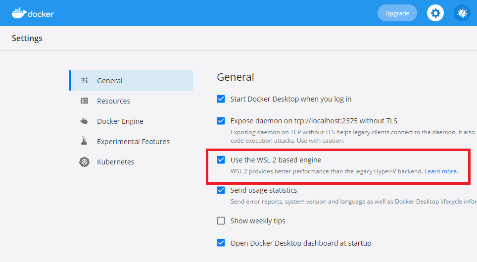

# Kubernetes with Docker Desktop

Docker Desktop is freely available in a community edition, for Windows and Mac.
Supposed that you're having Docker on your Windows host so you already have Docker Desktop installed.

If not you can install it with the installer from the official site here: https://www.docker.com/products/docker-desktop 

Setting up a K8s cluster for development purposes locally in this case is pretty simple.
You just need to enable K8s via the Docker Desktop settings.

1. Open Docker Desktop window (Dashboard).
2. Navigate to Settings.
3. Click on menu item `Kubernetes`.
4. Check the `Enable Kubernetes` checkbox.
5. That’s it!


Docker Desktop will download all the Kubernetes images in the background and get everything started up. When it’s ready should see two green lights in the bottom of the settings screen saying Docker running and Kubernetes running.

**Note:** You can always reset the K8s cluster that you have from here by clicking the `Reset Kubernetes Cluster` button. This will clear up your local K8s environment for a fresh start.

At this point Docker Desktop on Windows automatically had created a single node cluster for us so we don't have to install Minikube or Kind for this purpose.

To check our cluster is ready and up and running we can get the `cluster-info`:
```
PS> kubectl cluster-info
// Expected output:
Kubernetes master is running at https://kubernetes.docker.internal:6443
KubeDNS is running at https://kubernetes.docker.internal:6443/api/v1/namespaces/kube-system/services/kube-dns:dns/proxy

```

**Note**: For troubleshooting you can find the DockerDesktop logs in `~\AppData\Local\Docker\log.txt`.

## WSL2 backend

Using Docker Desktop with WSL2 integration enabled is recommended. Please make sure that the WSL2 support is enabled.

